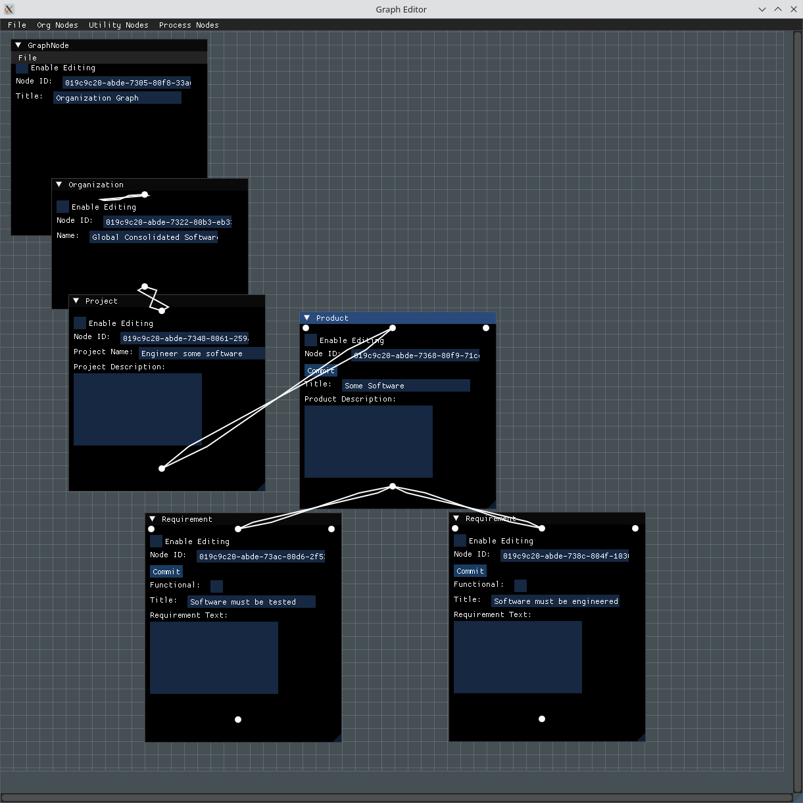
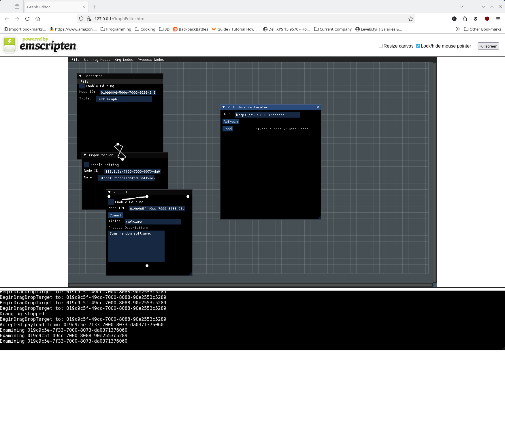

# ImguiWidgets

This is a simple full-stack Imgui node editor for my RequirementsManager
project. This can be built natively or with the emscripten SDK. The
Imgui widgets here include the application window that presents a 
menu bar along the top and draws a grid, and unique windows for each
of the data types in RequirementsManager.

Included is a examples directory with some scripts and a docker file
that will proxy the REST service built in RequirementsManager and
serve the GraphEditor WASM code. There needs to be some SSL stuff
set up for that to work, which the scripts will do for you. You can
import the SSL .pem file that gets generated into your browser
(See the warnings about that directory) so you don't get warnings
or errors when running the emscripten version of the code in your
browser.

The UI looks like this when built natively:

When run in the browser, it looks like this:

## Whats here RIGHT NOW

 * Emscripten support to build and run this in your browser.
   See the Emscripten notes in the RequirementsManager/docs directory.
 * Widgets to support editing RequirementsManager Nodes. All current
   RequirementsManager Nodes are implemented.
 * NodeEditorWindow that can create the current Node Windows
   that I've implemented.
 * Load/Save to database
 * Load/Save to JSON file
 * Load/Save to REST service
 * Window placement on-load is a bit crap right now.
 * There's no way to close nodes or otherwise make them go away
   other than exiting the program.

## Goals:

 * Provide different views that graphs with specific data can
   be loaded in to (time sequence, notebook, et al.)
 * Provide a GUI for graph editing (Mostly done)
 * Provide load/save support
   ** To SQL database - Done. This will always be native build only.
   ** Export to JSON - Done for Native build (May do emscripten too.)
   ** Load/Save to REST - Load and Save work in emscripten,
      native REST load/save is implemented but still needs testing.
 * Native and emscripten builds (Done)
 * Learn more about Imgui (Done :-)
 * Demonstrate a non-trivial full-stack application written entirely
   in C++ that runs and looks the same both natively and in a web
   browser (Done)
 * Provide a reference docker build with certificate setup and
   nginx ssl proxying to the REST service so you can actually
   use it with the web app.
   
## Notes:

I don't usually do that much front end, so my Gui code is probably
awkward. It feels awkward anyway. This should improve with practice
though.

## Using

Node windows provide anchors at the top and bottom of the window.
These can be dragged to another anchor to link the two windows.

If a link already exists, dragging the one anchor to the opposite
end again will unlink the two nodes.

CommitableNodeWindows also have anchors to the left and right. I
put these controls at the top of the window so they won't interfere
with the other items in the window. I'm really starting to rethink
the whole CommitableNode thing. Feels like YAGNI and if it's not
YAGNI the implementation could be better. May deprecate.

Node windows have individual "Enable Editing" checkboxes which must
be checked if you want to edit the data in that node. NodeWindow
has several options for displaying this and could be set by default
to allow editing of any editable fields. I'm leaning toward displaying
the control and having it default to off just because I frequently
find myself accidentally putting text in random windows.

Load/Save both use graph nodes, so start your graph with a graph
node ("utlity nodes" -> "graph node" on the main menu) and link one
other node in your graph to the graph node. The graph node "File"
menu allows saving from the database or to JSON. The main editing
window File menu can load from the database or JSON.

## Todos

 * Docker images of the entire system so you can play with it
   without having to build it.
 * Keycloak authentication support (in the docker images)
 * Do something about Window placement.
 * Implement a way to close graphs without having to exit.
 * Do something about window placement.
 * Add Copyright window for the GUI so I can cite the various
   MIT/Apache licensed dependencies in the GUI.
 * Did I mention I should do something about the window placement?
 * Implement other views of graphs as there are several useful
   domains that will be represented in node data.
 * Python API for the GUI
